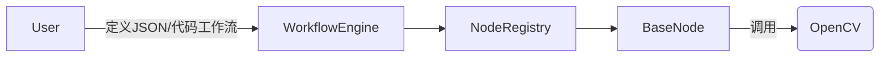

# 设计方案：Engine-first 最小闭环
- **日期:** 2025-09-01

## 1. 业务背景与目标
- **目标:** 2 周内交付可运行最小闭环：加载一个由 5 个核心节点组成的工作流并稳定执行（无 UI）。
- **价值:** 提供真实可运行演示，形成可测骨架，为 UI/视觉扩展提供清晰契约。

## 2. 架构与技术设计
- **整体架构图（简版）**


- **关键技术决策**
  - 节点契约：get_input_spec/get_output_spec/get_metadata/execute
  - 执行上下文：ExecutionContext 负责超时/取消/回调/指标
  - 注册器：装饰器注册 + 反射，分类与元数据缓存
  - 工作流定义：先支持“顺序/简单依赖”的 JSON/代码两种

- **API 规约（草案）**
```python
# 工作流定义（代码版）
workflow = {
  "nodes": [
    {"id": "n1", "type": "screenshot", "params": {"region": null}},
    {"id": "n2", "type": "find_image", "params": {"template": "btn.png", "threshold": 0.85}},
    {"id": "n3", "type": "click", "params": {"offset": [0, 0]}},
    {"id": "n4", "type": "delay", "params": {"ms": 500}},
    {"id": "n5", "type": "log", "params": {"message": "done"}},
  ],
  "edges": [["n1","n2"], ["n2","n3"], ["n3","n4"], ["n4","n5"]]
}
```

## 3. 考虑过的其他方案
- UI-first：演示性强但不可执行
- Vision-first：算法可用但缺少上下文与执行链

## 4. 未解决的问题/潜在风险
- DPI 缩放与坐标换算
- 前台焦点/权限导致的点击异常
- 模板匹配鲁棒性与阈值默认值
