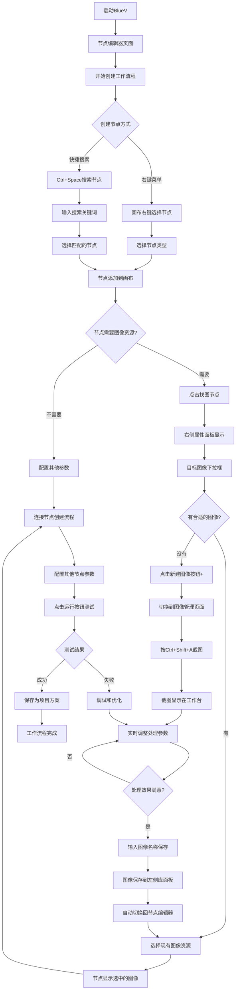
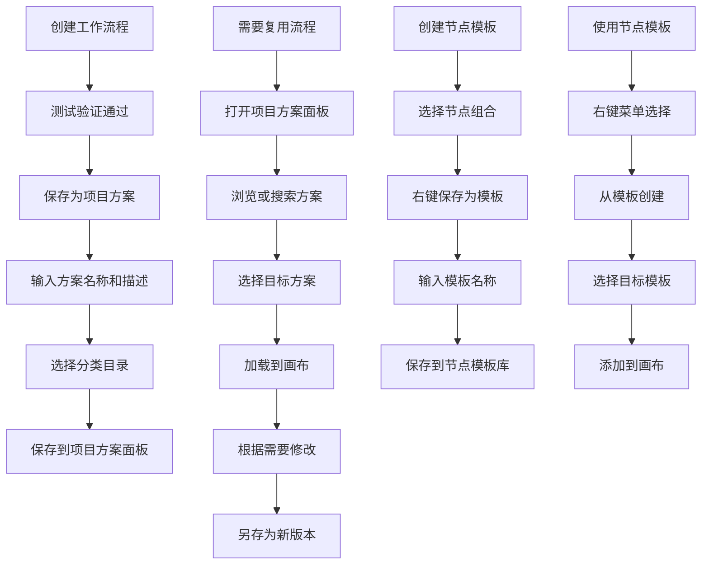
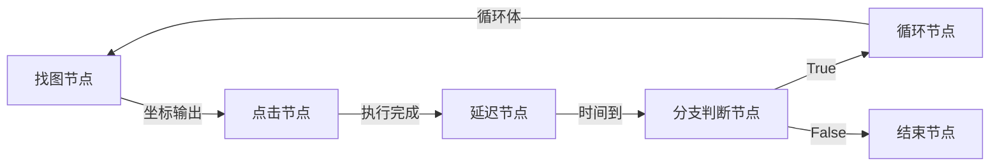
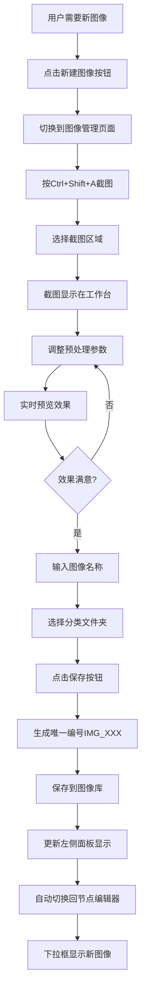
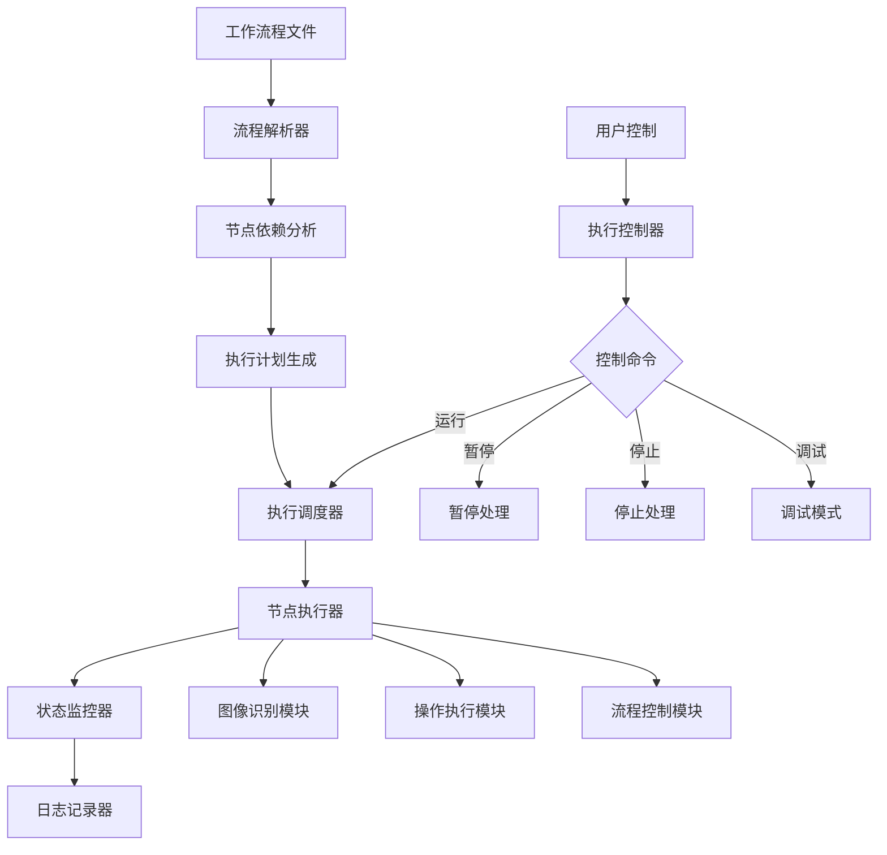
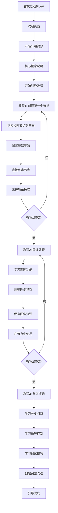
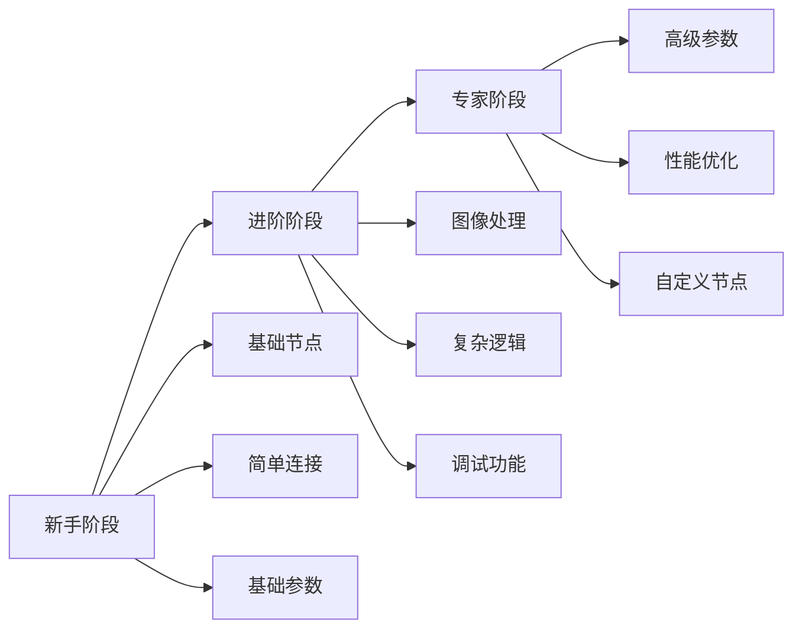

# BlueV游戏自动化蓝图框架 - 产品需求文档 (PRD) v1.0

**文档版本**: v1.0
**创建日期**: 2025-08-31
**产品经理**: AI Product Manager
**项目状态**: 需求确认完成，准备进入开发阶段

---

## 📋 执行摘要

BlueV是一款基于虚幻引擎蓝图系统设计理念的开源游戏自动化框架。通过可视化拖拽界面和专业级图像处理能力，让游戏爱好者能够零编程门槛地创建复杂的游戏自动化工作流程。

**核心价值主张**：
- 🎯 零编程门槛的可视化节点编程
- 🔍 专业级OpenCV图像处理集成
- 🎮 专为游戏场景优化的识别算法
- 🌐 开源社区驱动的生态建设

---

## 🎯 产品目标

### 主要目标
- **技术目标**：创建业界领先的可视化游戏自动化工具
- **用户目标**：让非技术用户能够创建复杂的游戏自动化流程
- **社区目标**：建立活跃的开源开发者和用户社区
- **影响目标**：成为游戏自动化领域的标杆开源项目

### 成功指标
- **技术指标**：图像识别准确率 > 95%，支持100-200节点工作流程
- **用户指标**：新用户30分钟内完成第一个工作流程创建
- **社区指标**：GitHub Star数量，活跃贡献者数量
- **质量指标**：工作流程执行成功率 > 90%

---

## 👥 目标用户

### 主要用户群体：中重度游戏爱好者
- **年龄段**：18-35岁
- **游戏经验**：每周游戏时间10+小时
- **技术背景**：基础计算机操作能力，无编程经验
- **核心需求**：减少重复性游戏任务，专注游戏核心乐趣

### 用户痛点
- 重复性游戏任务耗时过多（刷副本、日常任务、材料收集）
- 现有自动化工具需要编程知识，门槛过高
- 简单宏工具功能有限，无法处理复杂游戏场景
- 缺乏针对游戏优化的专业图像识别工具

---

## 🏗️ 产品架构

### 技术架构
```
BlueV架构
├── GUI层 (PySide6/Qt6)
│   ├── 节点编辑器页面
│   └── 图像管理页面
├── 核心引擎层 (Python)
│   ├── 节点系统
│   ├── 工作流程执行引擎
│   └── 图像处理引擎
├── 计算机视觉层 (OpenCV)
│   ├── 模板匹配算法
│   ├── 颜色检测算法
│   └── 图像预处理模块
└── 数据存储层 (SQLite + JSON)
    ├── 工作流程数据
    ├── 图像资源库
    └── 用户配置
```

### 平台支持
- **主要平台**：Windows 10/11
- **最低配置**：4GB RAM，支持DirectX 11的显卡
- **推荐配置**：8GB RAM，独立显卡（支持CUDA加速）

---

## 🎨 用户界面设计

### 双页面架构
**页面1：节点编辑器（默认启动页面）**
- 中央画布区域：节点拖拽和连接
- 左侧节点库面板：可用节点类型展示
- 右侧属性面板：选中节点的详细参数配置
- 底部执行控制栏：运行、暂停、停止、调试

**页面2：图像管理**
- 左侧图像库面板：已处理图像资源管理
- 中央图像处理工作台：OpenCV参数调优界面
- 右侧参数配置面板：详细的图像处理参数
- 底部工具栏：截图、保存、导入、导出

### 界面原型设计

#### 节点编辑器页面布局（优化版）
```
┌─────────────────────────────────────────────────────────────────────────────┐
│ BlueV - 游戏自动化蓝图框架                    [节点编辑器] [图像管理]        │
├─────────────────────────────────────────────────────────────────────────────┤
│ 📋 项目方案      │                画布区域                │  属性面板        │
│ ┌─────────────┐  │  ┌─────────────────────────────────┐  │ ┌─────────────┐  │
│ │💾 保存方案   │  │  │     ┌─────────────┐             │  │ │找图节点属性  │  │
│ │📂 加载方案   │  │  │     │ 🔍 找图节点  │             │  │ │             │  │
│ │             │  │  │     │ 图像:按钮.png│ ●─────────○ │  │ │目标图像:     │  │
│ │📁 我的方案   │  │  │     │ 阈值: 0.8   │             │  │ │[下拉框▼][+] │  │
│ │ • 登录流程   │  │  │     └─────────────┘             │  │ │             │  │
│ │ • 刷副本     │  │  │                                 │  │ │匹配阈值:     │  │
│ │ • 采集资源   │  │  │     ┌─────────────┐             │  │ │[滑块] 0.8   │  │
│ │ • 日常任务   │  │  │  ○──│ 👆 点击节点  │             │  │ │             │  │
│ │             │  │  │     │ 位置:找图结果│             │  │ │搜索区域:     │  │
│ │📁 节点模板   │  │  │     │ 类型:左键    │             │  │ │[选择] 全屏  │  │
│ │ • 登录组合   │  │  │     └─────────────┘             │  │ │             │  │
│ │ • 战斗循环   │  │  │                                 │  │ │[高级设置▼]  │  │
│ │ • 物品购买   │  │  │  💡 右键添加节点                │  │ │             │  │
│ │             │  │  │  ⌨️ Ctrl+Space 搜索节点         │  │ │             │  │
│ └─────────────┘  │  └─────────────────────────────────┘  │ └─────────────┘  │
├─────────────────────────────────────────────────────────────────────────────┤
│ ▶️ 运行  ⏸️ 暂停  ⏹️ 停止                                                   │
└─────────────────────────────────────────────────────────────────────────────┘
```

#### 图像管理页面布局
```
┌─────────────────────────────────────────────────────────────────────────────┐
│ BlueV - 游戏自动化蓝图框架                    [节点编辑器] [图像管理]        │
├─────────────────────────────────────────────────────────────────────────────┤
│ 📷 图像库        │           图像处理工作台            │  参数配置面板      │
│ ┌─────────────┐  │  ┌─────────────────────────────────┐  │ ┌─────────────┐  │
│ │🔍 [搜索框]   │  │  │                                 │  │ │图像预处理    │  │
│ │             │  │  │        实时处理预览              │  │ │             │  │
│ │📁 游戏A (3) │  │  │    ┌─────────────────────┐      │  │ │尺寸调整:     │  │
│ │📷 IMG_001   │  │  │    │                     │      │  │ │宽[___]高[___]│  │
│ │   卖出按钮   │  │  │    │    [处理后图像]     │      │  │ │☑️保持比例    │  │
│ │📷 IMG_002   │  │  │    │                     │      │  │ │             │  │
│ │   确认对话框 │  │  │    │                     │      │  │ │裁剪区域:     │  │
│ │📷 IMG_003   │  │  │    └─────────────────────┘      │  │ │X[__]Y[__]   │  │
│ │   血量条     │  │  │                                 │  │ │W[__]H[__]   │  │
│ │             │  │  │ [👁️ 查看原图] 匹配度: 0.95      │  │ │             │  │
│ │📁 游戏B (2) │  │  │ 处理时间: 15ms                  │  │ │图像增强:     │  │
│ │📷 IMG_004   │  │  │                                 │  │ │             │  │
│ │   开始按钮   │  │  │                                 │  │ │亮度: [滑块]  │  │
│ │📷 IMG_005   │  │  │                                 │  │ │对比度:[滑块] │  │
│ │   设置图标   │  │  │                                 │  │ │饱和度:[滑块] │  │
│ └─────────────┘  │  └─────────────────────────────────┘  │ └─────────────┘  │
├─────────────────────────────────────────────────────────────────────────────┤
│ 📸 截图(Ctrl+Shift+A)  💾 保存配置  📂 导入  📤 导出  🔄 重置  ❌ 清除    │
└─────────────────────────────────────────────────────────────────────────────┘
```

### 核心用户流程图（优化版）

#### 完整用户工作流程


#### 项目方案管理流程


---

## 🔧 功能需求

### MVP核心功能 (P0优先级)

#### 1. 可视化节点编辑器（优化版）

**节点创建方式改进**
- **右键上下文菜单**：在画布空白区域右键显示完整的节点分类菜单
- **快捷键搜索**：Ctrl+Space调出节点搜索功能，支持模糊匹配
- **智能添加**：搜索选中后直接添加到鼠标位置
- **自定义快捷键**：Ctrl+Space可在程序设置中自定义修改

**项目方案管理系统**
- **方案保存**：将完整的工作流程保存为可复用的方案
- **版本管理**：支持方案的版本控制和历史记录
- **分类管理**：支持方案的分类组织和快速检索
- **模板系统**：将常用节点组合保存为模板供快速调用

**基础节点库设计**

**视觉识别节点**
```
找图节点原型:
┌─────────────────┐
│ 🔍 找图节点      │
│ 图像: 按钮.png  │
│ 阈值: 0.8      │
│ ● ──────────── ○│
└─────────────────┘

找色节点原型:
┌─────────────────┐
│ 🎨 找色节点      │
│ 颜色: #FF0000   │
│ 容差: 10       │
│ ● ──────────── ○│
└─────────────────┘

等待图片出现节点:
┌─────────────────┐
│ ⏳ 等待图片出现  │
│ 图像: 加载.png  │
│ 超时: 30s      │
│ ● ──────────── ○│
└─────────────────┘
```

**操作执行节点**
```
点击节点原型:
┌─────────────────┐
│ 👆 点击节点      │
│ 位置: 找图结果   │
│ 类型: 左键      │
│ ○ ──────────── ○│
└─────────────────┘

延迟节点原型:
┌─────────────────┐
│ ⏱️ 延迟节点      │
│ 时间: 2.5s     │
│ 随机: ±0.5s    │
│ ○ ──────────── ○│
└─────────────────┘

键盘输入节点:
┌─────────────────┐
│ ⌨️ 键盘输入      │
│ 内容: "Hello"   │
│ 延迟: 100ms    │
│ ○ ──────────── ○│
└─────────────────┘
```

**流程控制节点**
```
分支判断节点:
┌─────────────────┐
│ 🔀 分支判断      │
│ 条件: 图片存在   │
│ ○ ──┬── True ○ │
│     └── False ○ │
└─────────────────┘

循环节点:
┌─────────────────┐
│ 🔄 循环节点      │
│ 类型: 计数循环   │
│ 次数: 5次      │
│ ○ ──────────── ○│
└─────────────────┘

子流程节点:
┌─────────────────┐
│ 📋 子流程        │
│ 名称: 登录流程   │
│ 状态: 已加载    │
│ ○ ──────────── ○│
└─────────────────┘
```

**节点连接逻辑**


**节点属性面板设计**

**找图节点属性面板原型**
```
┌─────────────────────────────────────┐
│ 找图节点属性                         │
├─────────────────────────────────────┤
│ 基础设置                            │
│ 目标图像: [下拉框 ▼] [新建图像 +]    │
│ ┌─────────────────────────────────┐ │
│ │ IMG_001: 卖出按钮        📷     │ │
│ │ IMG_002: 确认对话框      📷     │ │
│ │ IMG_003: 血量条          📷     │ │
│ └─────────────────────────────────┘ │
│                                     │
│ 匹配阈值: [━━━●━━━] 0.8             │
│ 搜索区域: [选择区域] 全屏            │
│ 超时设置: [___] 5 秒               │
│                                     │
│ 高级设置 [展开 ▼]                   │
│ ┌─────────────────────────────────┐ │
│ │ 匹配算法: [下拉] TM_CCOEFF_NORMED│ │
│ │ 多目标检测: [☐] 启用             │ │
│ │ 旋转容差: [━━●━━━] ±5°          │ │
│ │ 缩放容差: [━━●━━━] ±10%         │ │
│ │ 边缘增强: [☑] 启用              │ │
│ └─────────────────────────────────┘ │
│                                     │
│ 输出预览                            │
│ ┌─────────────────────────────────┐ │
│ │ 预期输出: 坐标(x, y)             │ │
│ │ 数据类型: Point2D               │ │
│ │ 连接状态: ● 已连接到点击节点      │ │
│ └─────────────────────────────────┘ │
└─────────────────────────────────────┘
```

**节点显示策略**
- 节点外观显示基础参数（图像名称、阈值等）
- 详细参数配置通过右侧属性面板进行
- 支持节点拖拽、连接、复制、删除操作
- 实时连接验证和错误提示
- 节点状态指示（就绪/运行/错误/完成）

#### 2. 专业图像管理系统
**图像处理工作台**
- 全局快捷键截图功能 (Ctrl+Shift+A)
- 实时图像处理参数调整和预览
- 单一图像显示区域，实时显示处理效果
- "查看原图"按钮可临时显示原始图像
- 支持的处理功能：
  - 图像增强：亮度、对比度、饱和度调整
  - 噪声处理：高斯模糊、中值滤波
  - 边缘检测：Canny边缘检测
  - 颜色空间转换：RGB、HSV转换
  - 模板匹配优化：多尺度匹配、阈值调整

**图像资源管理系统设计**

**左侧图像库面板原型**
```
┌─────────────────────────────────────┐
│ 图像资源库                          │
├─────────────────────────────────────┤
│ 🔍 [搜索图像资源...]               │
├─────────────────────────────────────┤
│ 📊 统计信息                        │
│ 总计: 12个图像 | 今日新增: 3个      │
├─────────────────────────────────────┤
│ 📁 游戏A (5个图像)                 │
│ ┌─────────────────────────────────┐ │
│ │ 📷 IMG_001: 卖出按钮             │ │
│ │    [64x64缩略图] 引用:3次        │ │
│ │    创建:今天 14:30               │ │
│ │    [编辑] [复制] [删除]          │ │
│ └─────────────────────────────────┘ │
│ ┌─────────────────────────────────┐ │
│ │ 📷 IMG_002: 确认对话框           │ │
│ │    [64x64缩略图] 引用:1次        │ │
│ │    创建:今天 15:45               │ │
│ │    [编辑] [复制] [删除]          │ │
│ └─────────────────────────────────┘ │
│                                     │
│ 📁 游戏B (3个图像) [折叠 ▲]        │
│                                     │
│ 📁 通用UI (4个图像) [展开 ▼]       │
│ ┌─────────────────────────────────┐ │
│ │ 📷 IMG_010: 关闭按钮             │ │
│ │    [64x64缩略图] 引用:8次        │ │
│ │    创建:昨天 09:15               │ │
│ │    [编辑] [复制] [删除]          │ │
│ └─────────────────────────────────┘ │
└─────────────────────────────────────┘
```

**图像处理工作台界面原型**
```
┌─────────────────────────────────────────────────────────────────────────────┐
│ 图像处理工作台                                                               │
├─────────────────────────────────────────────────────────────────────────────┤
│                                                                             │
│                          实时处理预览区域                                   │
│                    ┌─────────────────────────────┐                         │
│                    │                             │                         │
│                    │                             │                         │
│                    │      [实时处理后图像]       │                         │
│                    │                             │                         │
│                    │                             │                         │
│                    │                             │                         │
│                    └─────────────────────────────┘                         │
│                                                                             │
│ [👁️ 查看原图] [🔄 重置处理] 匹配度: 0.95 | 处理时间: 15ms                  │
│                                                                             │
│ 💡 提示: 调整右侧参数可实时预览处理效果                                     │
└─────────────────────────────────────────────────────────────────────────────┘
```

**参数配置面板原型（实时处理）**
```
┌─────────────────────────────────────┐
│ 图像处理参数配置                     │
├─────────────────────────────────────┤
│ 📐 图像预处理                       │
│ ┌─────────────────────────────────┐ │
│ │ 尺寸调整                         │ │
│ │ 宽度: [____] 像素 高度: [____]   │ │
│ │ ☑️ 保持宽高比                    │ │
│ │                                 │ │
│ │ 裁剪区域                         │ │
│ │ X:[___] Y:[___] W:[___] H:[___]  │ │
│ │ [选择区域] [重置]                │ │
│ │                                 │ │
│ │ 旋转角度: [━━━●━━━] 0°          │ │
│ └─────────────────────────────────┘ │
│                                     │
│ 🎨 图像增强 (实时预览)              │
│ ┌─────────────────────────────────┐ │
│ │ 亮度:     [━━━●━━━] +10         │ │
│ │ 对比度:   [━━━●━━━] 1.2         │ │
│ │ 饱和度:   [━━━●━━━] 1.0         │ │
│ │ 锐化:     [━━━●━━━] 0.5         │ │
│ │ 伽马校正: [━━━●━━━] 1.0         │ │
│ └─────────────────────────────────┘ │
│                                     │
│ 🔧 噪声处理 (实时预览)              │
│ ┌─────────────────────────────────┐ │
│ │ 高斯模糊: [━━●━━━━] 1.0         │ │
│ │ 中值滤波: [━━●━━━━] 3x3         │ │
│ │ 双边滤波: [☐] 启用              │ │
│ │   - 空间标准差: [━━●━━━] 75     │ │
│ │   - 颜色标准差: [━━●━━━] 75     │ │
│ └─────────────────────────────────┘ │
│                                     │
│ 🔍 边缘检测 (实时预览)              │
│ ┌─────────────────────────────────┐ │
│ │ Canny边缘: [☑] 启用             │ │
│ │   - 低阈值: [━━●━━━━] 50        │ │
│ │   - 高阈值: [━━●━━━━] 150       │ │
│ │   - 核大小: [下拉] 3x3          │ │
│ │                                 │ │
│ │ Sobel算子: [☐] 启用             │ │
│ │   - X方向: [☑] Y方向: [☑]      │ │
│ └─────────────────────────────────┘ │
│                                     │
│ 🌈 颜色空间 (实时预览)              │
│ ┌─────────────────────────────────┐ │
│ │ 色彩空间: [下拉] RGB ▼          │ │
│ │ 通道分离: [☑]R [☑]G [☑]B       │ │
│ │ 二值化: [☐] 启用                │ │
│ │   - 阈值: [━━●━━━━] 127         │ │
│ │   - 类型: [下拉] THRESH_BINARY  │ │
│ └─────────────────────────────────┘ │
│                                     │
│ 🎯 模板匹配优化 (实时预览)          │
│ ┌─────────────────────────────────┐ │
│ │ 匹配方法: [下拉] TM_CCOEFF_NORMED│ │
│ │ 多尺度匹配: [☑] 启用            │ │
│ │   - 尺度范围: 0.8 到 1.2        │ │
│ │   - 尺度步长: [━●━━━━] 0.1      │ │
│ │                                 │ │
│ │ 旋转不变: [☐] 启用              │ │
│ │   - 角度范围: ±[___]°           │ │
│ │   - 角度步长: [___]°            │ │
│ └─────────────────────────────────┘ │
│                                     │
│ [💾 保存配置] [🔄 重置默认] [📋 预设] │
└─────────────────────────────────────┘
```

**实时处理机制说明**
- **参数调整触发**：用户拖动滑块时实时处理图像
- **处理延迟优化**：参数调整停止后300ms执行处理，避免频繁计算
- **查看原图功能**：按住"查看原图"按钮时临时显示原始图像，松开恢复处理后图像
- **性能指标显示**：实时显示处理时间和匹配度，帮助用户优化参数

**图像资源创建流程图**


#### 3. 工作流程执行引擎

**执行引擎架构图**


**执行状态监控界面原型**
```
┌─────────────────────────────────────────────────────────────────────────────┐
│ 工作流程执行监控                                                             │
├─────────────────────────────────────────────────────────────────────────────┤
│ 📊 执行状态                                                                 │
│ ┌─────────────────────────────────────────────────────────────────────────┐ │
│ │ 流程名称: 游戏自动刷副本                                                 │ │
│ │ 执行状态: ▶️ 运行中                                                      │ │
│ │ 当前节点: [3/8] 找图节点 - 寻找确认按钮                                  │ │
│ │ 执行时间: 00:02:35                                                      │ │
│ │ 成功次数: 15次 | 失败次数: 1次                                           │ │
│ └─────────────────────────────────────────────────────────────────────────┘ │
│                                                                             │
│ 🔄 节点执行进度                                                            │
│ ┌─────────────────────────────────────────────────────────────────────────┐ │
│ │ ✅ [1] 找图节点 - 开始按钮     (完成 - 0.8s)                            │ │
│ │ ✅ [2] 点击节点 - 点击开始     (完成 - 0.2s)                            │ │
│ │ ▶️ [3] 找图节点 - 确认按钮     (执行中 - 2.1s)                          │ │
│ │ ⏳ [4] 点击节点 - 点击确认     (等待中)                                  │ │
│ │ ⏳ [5] 延迟节点 - 等待加载     (等待中)                                  │ │
│ │ ⏳ [6] 循环节点 - 重复执行     (等待中)                                  │ │
│ │ ⏳ [7] 分支判断 - 检查结果     (等待中)                                  │ │
│ │ ⏳ [8] 结束节点 - 流程完成     (等待中)                                  │ │
│ └─────────────────────────────────────────────────────────────────────────┘ │
│                                                                             │
│ 📝 执行日志 (最新10条)                                                     │
│ ┌─────────────────────────────────────────────────────────────────────────┐ │
│ │ [14:32:15] INFO  - 开始执行工作流程                                      │ │
│ │ [14:32:16] DEBUG - 找图节点: 在(1920x1080)屏幕中搜索"开始按钮.png"       │ │
│ │ [14:32:16] INFO  - 找图成功: 坐标(960, 540), 匹配度0.95                 │ │
│ │ [14:32:17] INFO  - 点击执行: 位置(960, 540), 类型=左键                  │ │
│ │ [14:32:17] DEBUG - 找图节点: 在(1920x1080)屏幕中搜索"确认按钮.png"       │ │
│ │ [14:32:18] WARN  - 找图超时: 2秒内未找到目标图像                        │ │
│ │ [14:32:18] INFO  - 重试找图: 第1次重试                                  │ │
│ │ [14:32:19] INFO  - 找图成功: 坐标(800, 600), 匹配度0.87                 │ │
│ │ [14:32:19] INFO  - 点击执行: 位置(800, 600), 类型=左键                  │ │
│ │ [14:32:20] INFO  - 延迟执行: 等待2.5秒                                  │ │
│ └─────────────────────────────────────────────────────────────────────────┘ │
│                                                                             │
│ 🎛️ 控制面板                                                                │
│ [▶️ 运行] [⏸️ 暂停] [⏹️ 停止] [🔄 重启] [🐛 调试模式] [📊 性能分析]        │
└─────────────────────────────────────────────────────────────────────────────┘
```

**调试模式界面原型**
```
┌─────────────────────────────────────────────────────────────────────────────┐
│ 调试模式 - 单步执行                                                         │
├─────────────────────────────────────────────────────────────────────────────┤
│ 🔍 当前节点详情                                                            │
│ ┌─────────────────────────────────────────────────────────────────────────┐ │
│ │ 节点类型: 找图节点                                                       │ │
│ │ 节点名称: 寻找确认按钮                                                   │ │
│ │ 输入参数:                                                               │ │
│ │   - 目标图像: IMG_002 (确认按钮.png)                                    │ │
│ │   - 匹配阈值: 0.8                                                       │ │
│ │   - 搜索区域: 全屏 (0,0,1920,1080)                                      │ │
│ │   - 超时时间: 5秒                                                       │ │
│ │                                                                         │ │
│ │ 执行结果:                                                               │ │
│ │   - 状态: ✅ 成功                                                        │ │
│ │   - 找到坐标: (800, 600)                                                │ │
│ │   - 匹配度: 0.87                                                        │ │
│ │   - 执行时间: 1.2秒                                                     │ │
│ └─────────────────────────────────────────────────────────────────────────┘ │
│                                                                             │
│ 📸 截图预览                                                                │
│ ┌─────────────────────────────────────────────────────────────────────────┐ │
│ │ 当前屏幕截图                    │  匹配结果预览                          │ │
│ │ ┌─────────────────────────────┐ │ ┌─────────────────────────────────┐   │ │
│ │ │                             │ │ │        🎯                       │   │ │
│ │ │                             │ │ │    ┌─────────┐                  │   │ │
│ │ │                             │ │ │    │ 确认按钮 │ ← 匹配位置        │   │ │
│ │ │                             │ │ │    └─────────┘                  │   │ │
│ │ │                             │ │ │                                 │   │ │
│ │ └─────────────────────────────┘ │ └─────────────────────────────────┘   │ │
│ └─────────────────────────────────────────────────────────────────────────┘ │
│                                                                             │
│ 🎛️ 调试控制                                                                │
│ [⏭️ 下一步] [⏯️ 继续执行] [🔄 重新执行] [📋 查看变量] [💾 保存断点]        │
└─────────────────────────────────────────────────────────────────────────────┘
```

**执行引擎核心功能**
- 工作流程解析和执行
- 实时执行状态监控
- 执行日志和错误处理
- 支持暂停、继续、停止操作
- 单步调试和断点功能
- 性能分析和优化建议
- 异常恢复和重试机制

### 扩展功能 (P1优先级)

#### 扩展节点库
- **找色节点**：基于颜色的目标检测
- **OCR文字节点**：文字识别和提取
- **循环节点**：for循环和while循环
- **变量节点**：数据存储和传递
- **键盘输入节点**：文本输入和快捷键
- **拖拽节点**：鼠标拖拽操作

#### 高级图像处理
- 深度学习模型集成 (YOLO目标检测)
- 图像分割和轮廓检测
- 光学字符识别 (OCR) 优化
- 图像相似度计算

#### 工作流程管理
- 工作流程模板系统
- 子流程调用功能
- 工作流程导入导出
- 版本控制和历史记录

---

## 📊 技术规格

### 性能要求
- **图像处理响应时间**：参数调整实时预览 < 100ms
- **节点渲染性能**：支持200个节点流畅编辑，拖拽延迟 < 16ms
- **识别准确率**：经过图像处理优化后 > 95%
- **内存占用**：正常运行 < 512MB，大型工作流程 < 1GB
- **启动时间**：程序启动 < 5秒

### 兼容性要求
- **操作系统**：Windows 10 (1903+), Windows 11
- **Python版本**：Python 3.8+
- **依赖库**：PySide6, OpenCV 4.5+, NumPy, Pillow
- **显示器**：支持高DPI显示器，最小分辨率1366x768

### 安全性要求
- 本地数据处理，保护用户隐私
- 不读取游戏内部数据，仅进行界面交互
- 兼容主流反作弊系统
- 开源代码，透明安全

---

## 🎮 用户体验设计

### 学习曲线设计

**新手引导流程图**


**引导教程界面原型**
```
┌─────────────────────────────────────────────────────────────────────────────┐
│ BlueV 新手引导 - 教程1: 创建第一个工作流程                                  │
├─────────────────────────────────────────────────────────────────────────────┤
│ 📚 教程进度: [████████░░] 80% (步骤 4/5)                                   │
│                                                                             │
│ 🎯 当前任务: 连接节点创建流程                                               │
│ ┌─────────────────────────────────────────────────────────────────────────┐ │
│ │ 很好！您已经成功创建了找图节点和点击节点。                               │ │
│ │ 现在让我们把它们连接起来，创建您的第一个自动化流程。                     │ │
│ │                                                                         │ │
│ │ 📋 操作步骤:                                                            │ │
│ │ 1. 点击找图节点右侧的输出端口 ●                                         │ │
│ │ 2. 拖拽到点击节点左侧的输入端口 ○                                       │ │
│ │ 3. 松开鼠标完成连接                                                     │ │
│ │                                                                         │ │
│ │ 💡 提示: 连接成功后会显示一条连接线                                     │ │
│ └─────────────────────────────────────────────────────────────────────────┘ │
│                                                                             │
│ 🖼️ 操作演示                                                                │
│ ┌─────────────────────────────────────────────────────────────────────────┐ │
│ │                    画布区域                                             │ │
│ │  ┌─────────────┐                    ┌─────────────┐                     │ │
│ │  │ 🔍 找图节点  │                    │ 👆 点击节点  │                     │ │
│ │  │ 图像:按钮.png│ ● ←─ 请连接这里 ─→ ○ │ 位置:找图结果│                     │ │
│ │  │ 阈值: 0.8   │                    │ 类型:左键    │                     │ │
│ │  └─────────────┘                    └─────────────┘                     │ │
│ │                                                                         │ │
│ │                        ↑ 高亮提示连接点                                 │ │
│ └─────────────────────────────────────────────────────────────────────────┘ │
│                                                                             │
│ [⏮️ 上一步] [跳过教程] [❓ 帮助] [下一步 ⏭️]                                │
└─────────────────────────────────────────────────────────────────────────────┘
```

**渐进式功能开放策略**


**功能解锁条件**
- **第一阶段解锁条件**：完成新手教程
  - 可用节点：找图、点击、延迟、分支判断
  - 可用功能：基础参数配置、简单连接

- **第二阶段解锁条件**：成功运行5个工作流程
  - 新增节点：找色、OCR、循环、变量
  - 新增功能：图像处理工作台、调试模式

- **第三阶段解锁条件**：创建包含10个以上节点的复杂流程
  - 新增节点：子流程、自定义节点
  - 新增功能：性能分析、高级参数、批量操作

#### 右键上下文菜单设计
```
画布右键菜单:
┌─────────────────────────┐
│ 🔍 视觉识别              │
│   ├─ 找图节点            │
│   ├─ 找色节点            │
│   ├─ 等待图片出现        │
│   ├─ 等待图片消失        │
│   └─ OCR文字识别         │
│                         │
│ ⚡ 操作执行              │
│   ├─ 点击节点            │
│   ├─ 拖拽节点            │
│   ├─ 键盘输入            │
│   └─ 延迟节点            │
│                         │
│ 🔄 流程控制              │
│   ├─ 分支判断            │
│   ├─ 循环节点            │
│   ├─ 子流程调用          │
│   └─ 跳转节点            │
│                         │
│ 📊 数据处理              │
│   ├─ 变量节点            │
│   ├─ 计数器              │
│   ├─ 随机数生成          │
│   └─ 字符串处理          │
│                         │
│ ─────────────────────── │
│ 📋 从模板创建            │
│ 📁 保存为模板            │
└─────────────────────────┘
```

#### 节点搜索功能界面
```
Ctrl+Space 调出搜索框:
┌─────────────────────────────────────┐
│ 🔍 搜索节点: [找图____________]      │
├─────────────────────────────────────┤
│ 🔍 找图节点                         │
│    基于模板匹配的图像识别           │
│                                     │
│ 🔍 找色节点                         │
│    基于颜色的目标检测               │
│                                     │
│ ⏳ 等待图片出现                     │
│    持续监控直到目标图像出现         │
│                                     │
│ 💡 提示: 使用↑↓选择，Enter确认      │
└─────────────────────────────────────┘
```

#### 项目方案面板详细设计
```
┌─────────────────────────────────────┐
│ 📋 项目方案面板                     │
├─────────────────────────────────────┤
│ 💾 保存方案  📂 加载方案            │
│ ┌─────────────────────────────────┐ │
│ │ 方案名称: [当前工作流程_____]    │ │
│ │ [💾 保存] [📋 另存为]           │ │
│ └─────────────────────────────────┘ │
│                                     │
│ 📁 我的方案 (5个)                  │
│ ┌─────────────────────────────────┐ │
│ │ 📄 登录流程 v1.2                │ │
│ │    节点数: 8 | 修改: 今天 14:30  │ │
│ │    [加载] [重命名] [删除]        │ │
│ └─────────────────────────────────┘ │
│ ┌─────────────────────────────────┐ │
│ │ 📄 刷副本流程 v2.1              │ │
│ │    节点数: 25 | 修改: 昨天 16:45 │ │
│ │    [加载] [重命名] [删除]        │ │
│ └─────────────────────────────────┘ │
│                                     │
│ 📁 节点模板 (8个)                  │
│ ┌─────────────────────────────────┐ │
│ │ 🔧 登录组合                     │ │
│ │    包含: 找图→点击→延迟          │ │
│ │    [使用] [编辑] [删除]          │ │
│ └─────────────────────────────────┘ │
│ ┌─────────────────────────────────┐ │
│ │ 🔧 战斗循环                     │ │
│ │    包含: 循环→找图→分支判断      │ │
│ │    [使用] [编辑] [删除]          │ │
│ └─────────────────────────────────┘ │
│                                     │
│ [📁 新建分类] [📤 导出] [📥 导入]   │
└─────────────────────────────────────┘
```

### 快捷键系统（更新版）
```
全局快捷键：
Ctrl + Shift + A    # 全局截图
Ctrl + Shift + N    # 新建图像资源
Ctrl + Tab          # 页面切换
Ctrl + Space        # 节点搜索（可自定义）
F5                  # 运行工作流程
F8                  # 暂停/继续

编辑器快捷键：
右键               # 显示节点创建菜单
Ctrl + C/V/X        # 复制/粘贴/剪切节点
Ctrl + Z/Y          # 撤销/重做
Delete              # 删除选中节点
Ctrl + A            # 全选节点
Ctrl + G            # 节点分组
Ctrl + S            # 保存当前方案
Ctrl + O            # 打开方案
```

### 错误处理和用户反馈
- 友好的错误提示信息
- 详细的操作指导建议
- 实时的参数验证反馈
- 完整的操作日志记录

---

## 🚀 开发计划

### MVP开发阶段 (6个月)

**Phase 1: 核心框架 (2个月)**
- PySide6界面框架搭建
- 双页面架构实现
- 基础节点系统开发
- 简单的拖拽连接功能

**Phase 2: 图像处理 (2个月)**
- OpenCV集成和优化
- 图像管理页面开发
- 基础图像处理功能实现
- 找图节点完整实现

**Phase 3: 执行引擎 (2个月)**
- 工作流程执行引擎开发
- 调试和监控功能
- 性能优化和测试
- 用户测试和反馈收集

### 质量保证计划
- **单元测试**：核心算法和功能模块
- **集成测试**：完整工作流程执行
- **性能测试**：大型工作流程和长时间运行
- **用户测试**：目标用户群体的可用性测试

---

## 📈 项目风险和缓解策略

### 技术风险
**风险1：大型工作流程性能问题**
- 缓解策略：虚拟化渲染、节点分组、智能缓存

**风险2：图像识别准确率不达标**
- 缓解策略：多算法融合、用户参数调优、机器学习优化

**风险3：跨游戏兼容性问题**
- 缓解策略：通用算法设计、用户自定义配置、社区模板库

### 用户采用风险
**风险1：学习门槛仍然过高**
- 缓解策略：详细教程、智能引导、模板库、社区支持

**风险2：功能复杂度与易用性冲突**
- 缓解策略：渐进式功能开放、智能默认值、专家模式切换

### 项目管理风险
**风险1：开发周期延长**
- 缓解策略：敏捷开发、MVP优先、定期里程碑检查

**风险2：社区建设困难**
- 缓解策略：早期用户参与、开发透明化、积极响应反馈

---

## 🌟 开源项目策略

### GitHub项目规划
- **代码组织**：清晰的模块化结构和文档
- **贡献指南**：详细的开发者参与指南
- **Issue管理**：标准化的问题报告和功能请求模板
- **Wiki文档**：完整的用户手册和开发文档

### 社区建设
- **技术博客**：定期分享开发进展和技术细节
- **视频教程**：制作使用演示和开发教程
- **用户论坛**：建立用户交流和支持社区
- **开发者生态**：鼓励第三方节点和插件开发

### 开源协议
- **推荐协议**：MIT License (宽松开源协议)
- **商业友好**：允许商业使用和修改
- **社区驱动**：鼓励贡献和分叉

---

## 📋 验收标准

### MVP成功标准
**技术标准**
- ✅ 支持5种基础节点类型的完整实现
- ✅ 图像识别准确率在测试场景下 > 90%
- ✅ 支持50个节点的工作流程流畅编辑
- ✅ 程序启动时间 < 5秒，内存占用 < 256MB

**用户体验标准**
- ✅ 新用户能在30分钟内完成引导教程
- ✅ 用户能在1小时内独立创建并运行简单工作流程
- ✅ 图像处理参数调整能实时预览效果
- ✅ 节点连接操作直观易懂，错误率 < 10%

**质量标准**
- ✅ 工作流程执行成功率 > 85%
- ✅ 程序稳定运行2小时无崩溃
- ✅ 核心功能单元测试覆盖率 > 80%
- ✅ 用户反馈满意度 > 4.0/5.0

---

## 📞 联系信息

**项目负责人**: [待定]
**技术负责人**: [待定]
**GitHub仓库**: [待创建]
**项目官网**: [待建设]

---

**文档状态**: ✅ 已确认
**下一步行动**: 开始技术架构设计和原型开发
**预计更新**: 项目启动后2周进行第一次PRD更新
