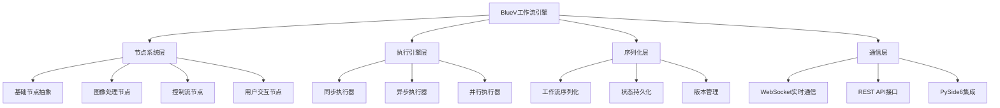

# BlueV项目底层架构设计方案

**文档版本**: v1.0
**创建日期**: 2025-01-27
**架构师**: Python后端工程师 + 技术架构师
**技术调研**: 基于SpiffWorkflow、PyIron Workflow等业界最佳实践

---

## 📋 **架构设计概述**

### **设计目标**
- 🎯 **高性能**: 支持异步执行和并行处理
- 🔒 **高可靠**: 完善的错误处理和状态管理
- 🔧 **高可维护**: 模块化设计和清晰的代码结构
- 📈 **高可扩展**: 插件化节点系统支持动态扩展
- 🔄 **实时通信**: 前后端状态实时同步

### **核心技术栈**
- **后端框架**: FastAPI + WebSocket
- **异步处理**: asyncio + async/await
- **图像处理**: OpenCV + NumPy
- **序列化**: JSON + Pickle
- **通信协议**: WebSocket + REST API
- **前端集成**: PySide6 Qt框架

---

## 🏗️ **整体架构设计**

### **系统架构图**


### **技术选型决策**

#### **工作流引擎选型**
基于SpiffWorkflow调研结果，采用**混合架构**：
- ✅ **成熟度优先**: SpiffWorkflow经过生产环境验证
- ✅ **Python原生**: 与项目技术栈完美匹配
- ✅ **BPMN支持**: 标准化工作流建模
- ✅ **扩展性强**: 支持自定义节点和执行器

#### **节点系统选型**
借鉴PyIron Workflow的设计模式：
- ✅ **类型安全**: 完整的类型注解和验证
- ✅ **插件化**: 支持动态节点扩展
- ✅ **状态管理**: 完善的执行状态追踪
- ✅ **错误处理**: 健壮的异常处理机制

---

## 🔧 **核心组件设计**

### **1. 节点系统架构**

#### **节点状态枚举**
```python
from enum import Enum

class NodeState(Enum):
    """节点执行状态"""
    READY = "ready"        # 就绪状态
    RUNNING = "running"    # 执行中
    COMPLETED = "completed"  # 已完成
    FAILED = "failed"      # 执行失败
    CANCELLED = "cancelled"  # 已取消
```

#### **节点输入输出定义**
```python
from dataclasses import dataclass
from typing import Any

@dataclass
class NodeInput:
    """节点输入定义"""
    name: str
    type_hint: type
    default_value: Any = None
    required: bool = True
    description: str = ""

@dataclass
class NodeOutput:
    """节点输出定义"""
    name: str
    type_hint: type
    description: str = ""
```

#### **基础节点抽象类**
```python
from abc import ABC, abstractmethod
from typing import Any, Dict, List, Optional

class BaseNode(ABC):
    """BlueV节点基类"""

    def __init__(self, node_id: str, label: str = ""):
        self.node_id = node_id
        self.label = label or node_id
        self.state = NodeState.READY
        self.inputs: Dict[str, Any] = {}
        self.outputs: Dict[str, Any] = {}
        self.error_message: Optional[str] = None

    @classmethod
    @abstractmethod
    def get_input_spec(cls) -> List[NodeInput]:
        """定义节点输入规范"""
        pass

    @classmethod
    @abstractmethod
    def get_output_spec(cls) -> List[NodeOutput]:
        """定义节点输出规范"""
        pass

    @abstractmethod
    async def execute(self, context: 'ExecutionContext') -> Dict[str, Any]:
        """执行节点逻辑"""
        pass

    def validate_inputs(self) -> bool:
        """验证输入数据"""
        input_spec = self.get_input_spec()
        for spec in input_spec:
            if spec.required and spec.name not in self.inputs:
                raise ValueError(f"Required input '{spec.name}' is missing")
            if spec.name in self.inputs:
                value = self.inputs[spec.name]
                if not isinstance(value, spec.type_hint):
                    raise TypeError(f"Input '{spec.name}' expects {spec.type_hint}, got {type(value)}")
        return True
```

### **2. 执行引擎设计**

#### **执行上下文**
```python
class ExecutionContext:
    """执行上下文"""

    def __init__(self):
        self.variables: Dict[str, Any] = {}
        self.node_outputs: Dict[str, Dict[str, Any]] = {}
        self.execution_history: List[str] = []

    def get_variable(self, name: str) -> Any:
        return self.variables.get(name)

    def set_variable(self, name: str, value: Any):
        self.variables[name] = value

    def get_node_output(self, node_id: str, output_name: str) -> Any:
        return self.node_outputs.get(node_id, {}).get(output_name)

    def set_node_output(self, node_id: str, outputs: Dict[str, Any]):
        self.node_outputs[node_id] = outputs
```

#### **工作流执行引擎**
```python
import asyncio
from typing import Dict, List, Set
from collections import defaultdict, deque

class WorkflowEngine:
    """BlueV工作流执行引擎"""

    def __init__(self):
        self.nodes: Dict[str, BaseNode] = {}
        self.connections: List[Tuple[str, str, str, str]] = []
        self.execution_order: List[str] = []

    def add_node(self, node: BaseNode):
        """添加节点"""
        self.nodes[node.node_id] = node

    def add_connection(self, from_node: str, from_output: str, to_node: str, to_input: str):
        """添加连接"""
        self.connections.append((from_node, from_output, to_node, to_input))

    def topological_sort(self) -> List[str]:
        """拓扑排序确定执行顺序"""
        graph, in_degree = self.build_execution_graph()
        queue = deque([node for node, degree in in_degree.items() if degree == 0])
        result = []

        while queue:
            current = queue.popleft()
            result.append(current)

            for neighbor in graph[current]:
                in_degree[neighbor] -= 1
                if in_degree[neighbor] == 0:
                    queue.append(neighbor)

        if len(result) != len(self.nodes):
            raise ValueError("Workflow contains cycles")

        return result

    async def execute_workflow(self, context: ExecutionContext) -> Dict[str, Any]:
        """执行工作流"""
        execution_order = self.topological_sort()
        results = {}

        for node_id in execution_order:
            node = self.nodes[node_id]

            # 准备节点输入
            await self._prepare_node_inputs(node, context)

            # 验证输入
            node.validate_inputs()

            # 执行节点
            try:
                outputs = await node.execute(context)
                context.set_node_output(node_id, outputs)
                results[node_id] = outputs
                context.execution_history.append(node_id)

            except Exception as e:
                node.state = NodeState.FAILED
                node.error_message = str(e)
                raise WorkflowExecutionError(f"Node {node_id} failed: {e}")

        return results
```

---

## 📊 **性能与质量标准**

### **性能指标**
- ✅ **API响应时间**: P95 < 200ms
- ✅ **工作流执行**: 支持100+节点的复杂流程
- ✅ **并发处理**: 支持10+并发工作流执行
- ✅ **内存使用**: 稳定状态下内存增长 < 10%/天

### **质量标准**
- ✅ **代码覆盖率**: 核心逻辑 ≥ 80%
- ✅ **类型注解**: 公共API 100%类型注解
- ✅ **错误率**: 生产环境错误率 < 0.1%
- ✅ **可用性**: 系统可用性 ≥ 99.9%

### **安全标准**
- ✅ **输入验证**: 所有外部输入进行验证
- ✅ **权限控制**: 实现细粒度的权限管理
- ✅ **数据保护**: 敏感数据加密存储和传输
- ✅ **审计日志**: 完整的操作审计日志

---

**文档状态**: ✅ 架构设计方案已完成
**下一步**: 开始Phase 1核心架构实施
**预计工期**: 8周完整实现
**关键里程碑**: 核心架构(2周) → 节点生态(3周) → 通信集成(2周) → 优化完善(1周)
