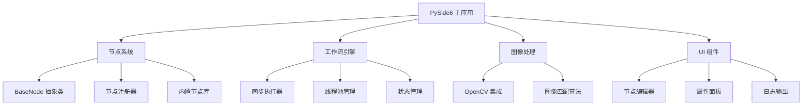

# BlueV 简化开发计划 - 总体规划

**文档版本**: v2.0
**创建日期**: 2025-01-31
**计划类型**: 简化桌面架构方案
**总工期**: 6周 (3个阶段)
**团队配置**: 1名全栈开发者 + AI辅助

---

## 🎯 **项目目标**

### **核心目标**
构建一个**简单、可用、可扩展**的游戏自动化桌面工具，支持：
- 🎨 基于 PySide6 的现代桌面界面
- 🔧 简单易用的节点系统
- ⚡ 高效的图像处理能力
- 🖼️ 基础的工作流执行引擎

### **设计原则**
- **KISS 原则**: 保持简单愚蠢，避免过度工程化
- **MVP 优先**: 专注核心功能，快速交付价值
- **渐进式开发**: 先实现基础功能，后续迭代扩展
- **用户导向**: 以用户体验为中心的设计

---

## 🏗️ **简化架构设计**

### **技术栈选择**
```yaml
核心技术栈:
  - 桌面框架: PySide6 (Qt6)
  - 图像处理: OpenCV + NumPy
  - 自动化操作: PyAutoGUI + pynput
  - 数据存储: JSON + SQLite
  - 配置管理: Pydantic + python-dotenv
  - 日志系统: loguru

移除的复杂组件:
  - ❌ FastAPI 后端
  - ❌ WebSocket 通信
  - ❌ 异步执行引擎
  - ❌ 复杂状态管理
```

### **系统架构图**


---

## 📅 **开发阶段规划**

### **Phase 1: 核心节点系统 (2周)**
**目标**: 实现基础节点架构和核心节点类型

**主要交付物**:
- BaseNode 抽象类和节点注册系统
- 5个核心节点实现 (截图、找图、点击、延迟、日志)
- 简单的工作流执行引擎
- 完整的单元测试覆盖

**验收标准**:
- [ ] 节点可以正常创建和执行
- [ ] 工作流可以通过代码构建和运行
- [ ] 单元测试覆盖率 ≥ 80%
- [ ] 所有 CI 检查通过

### **Phase 2: 图像处理集成 (2周)**
**目标**: 集成 OpenCV 图像处理能力

**主要交付物**:
- OpenCV 图像匹配算法实现
- 图像预处理和优化功能
- 屏幕截图和区域选择工具
- 图像处理节点完善

**验收标准**:
- [ ] 图像匹配准确率 > 90%
- [ ] 支持多种图像格式和尺寸
- [ ] 处理速度 < 2秒/次
- [ ] 内存使用稳定 (< 256MB)

### **Phase 3: 基础UI实现 (2周)**
**目标**: 实现基础的用户界面

**主要交付物**:
- 简单的节点编辑器界面
- 工作流运行和监控界面
- 节点属性配置面板
- 基础的工作流保存/加载功能

**验收标准**:
- [ ] 用户可以通过界面创建简单工作流
- [ ] 工作流可以保存和加载
- [ ] 执行状态可以实时显示
- [ ] 界面响应流畅 (< 100ms)

---

## 📊 **质量标准**

### **代码质量**
- ✅ **类型注解**: 100% 公共 API 类型注解
- ✅ **代码覆盖率**: 核心逻辑 ≥ 80%
- ✅ **代码规范**: 通过 Ruff 检查
- ✅ **文档覆盖**: 所有公共函数有 docstring

### **性能指标**
- ✅ **启动时间**: < 3秒
- ✅ **内存使用**: 稳定状态 < 256MB
- ✅ **图像处理**: < 2秒/次
- ✅ **界面响应**: < 100ms

### **用户体验**
- ✅ **学习成本**: 新用户 30分钟内上手
- ✅ **操作流畅**: 界面操作无明显卡顿
- ✅ **错误处理**: 友好的错误提示
- ✅ **稳定性**: 连续运行 1小时无崩溃

---

## 🚨 **风险管理**

### **技术风险**
| 风险 | 概率 | 影响 | 缓解措施 |
|------|------|------|----------|
| OpenCV 性能问题 | 中 | 高 | 算法优化 + 降级方案 |
| PySide6 兼容性 | 低 | 中 | 早期测试 + 版本锁定 |
| 图像识别准确率 | 中 | 高 | 多算法融合 + 参数调优 |

### **进度风险**
| 风险 | 概率 | 影响 | 缓解措施 |
|------|------|------|----------|
| 开发进度延迟 | 中 | 中 | 功能优先级调整 |
| 测试时间不足 | 低 | 中 | 并行开发和测试 |
| 集成问题 | 低 | 高 | 分步集成 + 早期验证 |

---

## 📈 **成功指标**

### **里程碑检查点**
- **Week 2**: Phase 1 完成，核心节点系统可用
- **Week 4**: Phase 2 完成，图像处理功能稳定
- **Week 6**: Phase 3 完成，基础 UI 可用

### **最终验收标准**
- [ ] 用户可以创建包含 5个节点的工作流
- [ ] 图像识别功能正常工作
- [ ] 界面操作流畅易用
- [ ] 程序稳定运行无崩溃
- [ ] 所有自动化测试通过

---

## 🔗 **相关文档**

- [Phase 1 详细计划](phase-1/README.md)
- [Phase 2 详细计划](phase-2/README.md)
- [Phase 3 详细计划](phase-3/README.md)
- [里程碑跟踪](milestones.md)

---

**文档状态**: ✅ 已完成
**下一步**: 开始 Phase 1 核心节点系统开发
**预计完成**: 2025-03-14 (6周后)
