# DevOps 工具链使用指南

## 🎯 概述

BlueV 项目采用现代化的 DevOps 工具链，确保代码质量、开发效率和项目可维护性。本指南将帮助开发者快速掌握工具链的使用方法。

## 🛠️ 工具链组成

### 核心工具

| 工具 | 用途 | 替代传统工具 | 性能提升 |
|------|------|--------------|----------|
| **Ruff** | 代码检查和格式化 | Black + flake8 + isort | 10-100x |
| **Pre-commit** | Git hooks 管理 | 手动检查 | 100% 自动化 |
| **GitHub Actions** | CI/CD 流程 | Jenkins/GitLab CI | 原生集成 |
| **MkDocs** | 文档生成 | Sphinx | 现代化 UI |
| **Trufflehog** | 安全扫描 | 手动审查 | 自动化检测 |

## 🚀 快速开始

### 1. 环境准备

```bash
# 克隆项目
git clone <repository-url>
cd OneDay_BuleV

# 创建虚拟环境
python -m venv venv

# 激活虚拟环境
# Windows
venv\Scripts\activate
# macOS/Linux
source venv/bin/activate

# 安装依赖
pip install -r requirements.txt
pip install -r requirements-dev.txt
```

### 2. 安装开发工具

```bash
# 安装 pre-commit hooks
pre-commit install

# 验证安装
pre-commit --version
ruff --version
```

## 📝 日常开发工作流

### 代码开发流程

```mermaid
graph LR
    A[编写代码] --> B[自动格式化]
    B --> C[代码检查]
    C --> D[运行测试]
    D --> E[提交代码]
    E --> F[CI/CD 流程]
    F --> G[自动部署]
```



### 1. 编写代码

正常编写 Python 代码，工具链会自动处理代码质量问题。

### 2. 代码检查和格式化

```bash
# 手动运行 Ruff 检查
ruff check .

# 手动运行 Ruff 格式化
ruff format .

# 修复可自动修复的问题
ruff check . --fix
```

### 3. 运行测试

```bash
# 运行所有测试
pytest

# 运行特定测试文件
pytest tests/unit/test_config.py

# 生成覆盖率报告
pytest --cov=bluev --cov-report=html
```

### 4. 提交代码

```bash
# 添加文件
git add .

# 提交（会自动触发 pre-commit hooks）
git commit -m "feat: add new feature"

# 推送到远程仓库
git push origin main
```

## 🔧 工具详细使用

### Ruff 配置

项目的 Ruff 配置位于 `pyproject.toml`：

```toml
[tool.ruff]
line-length = 88
target-version = "py38"

[tool.ruff.lint]
select = ["E", "F", "W", "C90", "I", "N", "UP", "S", "B", "A", "C4", "T20"]
ignore = ["E501", "S101", "T201", "N818", "UP009"]
```

#### 常用 Ruff 命令

```bash
# 检查代码问题
ruff check .

# 显示统计信息
ruff check . --statistics

# 只检查特定文件
ruff check bluev/config.py

# 格式化代码
ruff format .

# 检查格式是否正确
ruff format --check .
```

### Pre-commit Hooks

配置文件：`.pre-commit-config.yaml`

```yaml
repos:
  - repo: https://github.com/astral-sh/ruff-pre-commit
    rev: v0.1.9
    hooks:
      - id: ruff
        args: [--fix, --exit-non-zero-on-fix]
      - id: ruff-format
```

#### 常用 Pre-commit 命令

```bash
# 安装 hooks
pre-commit install

# 手动运行所有 hooks
pre-commit run --all-files

# 运行特定 hook
pre-commit run ruff

# 跳过 hooks 提交（紧急情况）
git commit -m "emergency fix" --no-verify
```

### GitHub Actions CI/CD

工作流文件：`.github/workflows/ci.yml`

#### 触发条件
- 推送到 `main` 或 `develop` 分支
- 创建 Pull Request 到 `main` 分支

#### 执行步骤
1. **多平台测试** - Windows/Linux/macOS
2. **多 Python 版本** - 3.8, 3.9, 3.10
3. **代码质量检查** - Ruff linting 和格式化
4. **测试执行** - pytest 和覆盖率报告
5. **安全扫描** - Trufflehog 密钥检测

### MkDocs 文档系统

配置文件：`mkdocs.yml`

#### 本地开发

```bash
# 安装 MkDocs
pip install mkdocs mkdocs-material

# 启动开发服务器
mkdocs serve

# 构建静态文档
mkdocs build

# 部署到 GitHub Pages
mkdocs gh-deploy
```

## 🚨 故障排除

### 常见问题和解决方案

#### 1. Pre-commit hooks 失败

**问题**: 提交时 hooks 执行失败

**解决方案**:
```bash
# 重新安装 hooks
pre-commit clean
pre-commit install

# 手动修复问题后重新提交
git add .
git commit -m "fix: resolve pre-commit issues"
```

#### 2. Ruff 检查失败

**问题**: 代码不符合 Ruff 规范

**解决方案**:
```bash
# 自动修复可修复的问题
ruff check . --fix

# 手动修复剩余问题
ruff check .

# 格式化代码
ruff format .
```

#### 3. 测试失败

**问题**: pytest 测试不通过

**解决方案**:
```bash
# 运行详细测试
pytest -v

# 运行特定失败的测试
pytest tests/unit/test_config.py::TestConfig::test_specific_method -v

# 查看测试覆盖率
pytest --cov=bluev --cov-report=term-missing
```

#### 4. 依赖问题

**问题**: 缺少依赖包或版本冲突

**解决方案**:
```bash
# 重新安装依赖
pip install -r requirements.txt --force-reinstall

# 更新开发依赖
pip install -r requirements-dev.txt --upgrade

# 检查依赖冲突
pip check
```

### 自动恢复脚本

项目提供了自动诊断和恢复脚本：

```bash
# 运行系统诊断
python scripts/error_recovery.py

# 运行性能基准测试
python scripts/performance_benchmark.py

# 运行端到端测试
python scripts/e2e_test.py
```

## 📊 性能基准

### 目标性能指标

| 指标 | 目标值 | 当前状态 |
|------|--------|----------|
| **Pre-commit hooks** | < 30秒 | ✅ 达标 |
| **CI/CD 流程** | < 5分钟 | ✅ 达标 |
| **文档构建** | < 2分钟 | ✅ 达标 |
| **代码检查** | < 10秒 | ✅ 达标 |
| **测试执行** | < 60秒 | ✅ 达标 |

### 性能优化建议

1. **使用缓存** - GitHub Actions 和本地都启用依赖缓存
2. **并行执行** - 测试和检查并行运行
3. **增量检查** - 只检查变更的文件
4. **合理配置** - 根据项目需求调整工具配置

## 🎓 最佳实践

### 代码提交规范

使用 [Conventional Commits](https://www.conventionalcommits.org/) 规范：

```bash
# 功能添加
git commit -m "feat: add user authentication"

# 问题修复
git commit -m "fix: resolve login validation issue"

# 文档更新
git commit -m "docs: update API documentation"

# 重构代码
git commit -m "refactor: optimize database queries"

# 性能改进
git commit -m "perf: improve image processing speed"
```

### 分支管理策略

```bash
# 主分支
main        # 生产环境代码
develop     # 开发环境代码

# 功能分支
feature/user-auth
feature/workflow-engine

# 修复分支
hotfix/critical-bug
bugfix/minor-issue
```

### 代码审查清单

- [ ] 代码符合项目规范
- [ ] 所有测试通过
- [ ] 代码覆盖率达标
- [ ] 文档已更新
- [ ] 性能影响评估
- [ ] 安全性检查通过

## 📚 进阶学习

### 推荐资源

- [Ruff 官方文档](https://docs.astral.sh/ruff/)
- [Pre-commit 使用指南](https://pre-commit.com/)
- [GitHub Actions 文档](https://docs.github.com/en/actions)
- [MkDocs 用户指南](https://www.mkdocs.org/)
- [Python 测试最佳实践](https://docs.pytest.org/en/stable/)

### 工具链扩展

考虑添加的工具：
- **Dependabot** - 自动依赖更新
- **CodeQL** - 代码安全分析
- **Renovate** - 依赖管理自动化
- **Sonar** - 代码质量分析

---

## 🤝 获得帮助

如果遇到问题：

1. 查看本指南的故障排除部分
2. 运行自动诊断脚本
3. 查看 GitHub Issues
4. 联系项目维护者

**记住**: 工具链的目标是提高开发效率，而不是增加负担。如果遇到问题，请及时寻求帮助！
