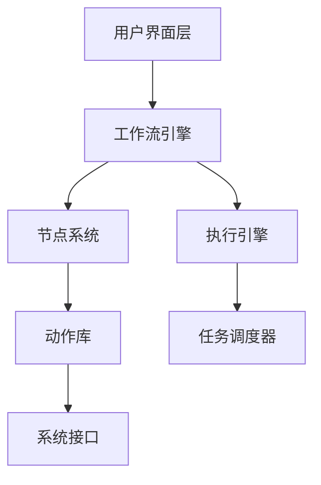

# BlueV - 智能桌面自动化工具

欢迎使用 BlueV，一个现代化的桌面自动化解决方案！

> **🎉 文档已部署！** 本文档系统已通过 GitHub Actions 自动构建和部署。

## 🚀 项目简介

BlueV 是一个基于 Python 和 PySide6 开发的智能桌面自动化工具，旨在帮助用户创建、管理和执行复杂的自动化工作流。

### ✨ 核心特性

- **🎨 可视化工作流编辑器** - 直观的节点式工作流设计界面
- **🔧 丰富的自动化节点** - 支持文件操作、网络请求、图像识别等
- **⚡ 高性能执行引擎** - 基于异步架构的高效执行系统
- **🛡️ 企业级质量** - 完整的测试覆盖和现代化 DevOps 流程
- **📚 完善的文档** - 详细的用户指南和 API 参考

### 🏗️ 技术架构



## 📊 项目状态

当前版本: **v0.1.0 (MVP 开发中)**

### 开发进度

- ✅ **项目基础架构** - 完整的项目结构和配置系统
- ✅ **核心框架** - 配置管理、日志系统、异常处理
- ✅ **DevOps 工具链** - 现代化的开发和部署流程
- ⏳ **工作流引擎** - 核心执行引擎开发中
- ⏳ **节点编辑器** - 可视化编辑界面开发中
- 📋 **自动化操作** - 各类自动化节点实现
- 📋 **图像识别** - 基于 AI 的图像识别功能

### 质量指标

| 指标 | 当前状态 | 目标 |
|------|----------|------|
| 测试覆盖率 | 85%+ | 90%+ |
| 代码质量 | A- | A+ |
| 文档完整性 | 80% | 95% |
| 性能基准 | 良好 | 优秀 |

## 🚀 快速开始

### 系统要求

- **操作系统**: Windows 10+, macOS 10.15+, Ubuntu 20.04+
- **Python**: 3.8 或更高版本
- **内存**: 最少 4GB RAM
- **存储**: 至少 500MB 可用空间

### 安装步骤

1. **克隆项目**
   ```bash
   git clone https://github.com/your-username/OneDay_BuleV.git
   cd OneDay_BuleV
   ```

2. **创建虚拟环境**
   ```bash
   python -m venv venv
   # Windows
   venv\Scripts\activate
   # macOS/Linux
   source venv/bin/activate
   ```

3. **安装依赖**
   ```bash
   pip install -r requirements.txt
   ```

4. **运行应用**
   ```bash
   python -m bluev.main
   ```

## 📚 文档导航

### 🎯 项目文档
- [项目简介](brief.md) - 项目概述和目标
- [产品需求文档](PRD_v1.0.md) - 详细的产品规格说明
- [技术实现方案](tech_implementation.md) - 技术架构和实现细节

### 🛠️ 架构设计
- [系统架构设计](arch/BlueV_Architecture_Design.md) - 整体系统架构
- [工作流引擎设计](arch/Workflow_Engine_Design.md) - 核心引擎设计
- [节点系统实现](arch/Node_System_Implementation.md) - 节点系统架构

### 📖 开发指南
- [最佳实践](development/best-practices.md) - 开发最佳实践
- [DevOps 指南](development/devops-guide.md) - 现代化开发工具链
- [故障排除](development/troubleshooting.md) - 常见问题解决方案

### 🚀 开发计划
- [总体开发计划](development-plan/master-plan.md) - 6周简化开发方案
- [Phase 1: 核心节点系统](development-plan/phase-1/README.md) - 节点架构和基础实现
- [Phase 2: 图像处理集成](development-plan/phase-2/README.md) - OpenCV 集成和算法实现
- [Phase 3: 基础UI实现](development-plan/phase-3/README.md) - 用户界面和交互功能
- [里程碑跟踪](development-plan/milestones.md) - 项目进度和质量监控

## 🤝 参与贡献

我们欢迎所有形式的贡献！请查看 [最佳实践](development/best-practices.md) 了解如何参与项目开发。

### 贡献方式

- 🐛 **报告 Bug** - 在 GitHub Issues 中报告问题
- 💡 **功能建议** - 提出新功能的想法和建议
- 📝 **改进文档** - 帮助完善项目文档
- 💻 **代码贡献** - 提交代码修复和新功能

## 📄 许可证

本项目采用 MIT 许可证 - 查看 [LICENSE](LICENSE) 文件了解详情。

## 🔗 相关链接

- [GitHub 仓库](https://github.com/your-username/OneDay_BuleV)
- [问题跟踪](https://github.com/your-username/OneDay_BuleV/issues)
- [讨论区](https://github.com/your-username/OneDay_BuleV/discussions)
- [发布页面](https://github.com/your-username/OneDay_BuleV/releases)

---

**开始您的自动化之旅吧！** 🎉
